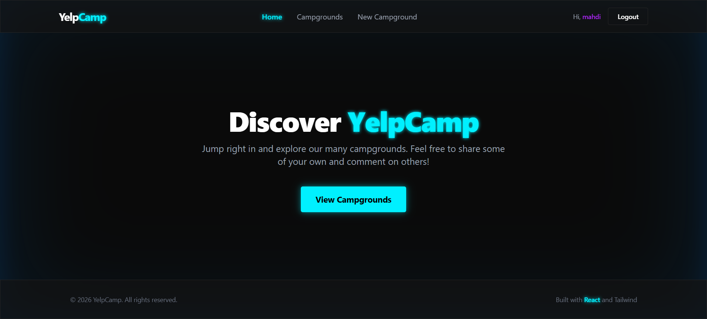

# YelpCamp - Enterprise Edition

> A full-stack web application allowing users to discover, create, and review campgrounds. Recently redesigned with a modern dark-mode neon aesthetic, it now features a fully decoupled React frontend and an Express.js JSON API backend.



## ⛺ Project Overview

YelpCamp is a modern Single Page Application (SPA) designed for campsite discovery and sharing. This repository is divided into two distinct workspaces:
- **[Frontend](./frontend/README.md)**: A high-performance React application built with Vite and styled using Tailwind CSS v4, featuring a premium dark-mode neon design.
- **[Backend](./backend/README.md)**: A robust Node.js/Express REST API utilizing MongoDB for data persistence, handling all authentication, authorization, and business logic.

### ✨ Key Features
- **Modern Neon Aesthetic**: Completely redesigned decoupled frontend.
  <br>
- **Robust Authentication**: Secure, cookie-based session persistence across the React SPA, fortified against NoSQL injection via `express-mongo-sanitize`. Global `AuthContext` ensures immediate UI state updates without page reloads.
- **Dynamic Review System**: Users can leave, edit, and delete reviews natively. Features a custom interactive **Neon 5-Star UI component** that responds to hover and click events.
  <br>
- **Media Management**: Direct image uploads routed securely to Cloudinary storage.

## 🚀 Getting Started

Follow these instructions to get the complete project running locally. You will need to start both the backend server and the frontend development server simultaneously.

### Prerequisites

- [Node.js](https://nodejs.org/)
- [MongoDB Community Server](https://www.mongodb.com/try/download/community)
- A [Cloudinary](https://cloudinary.com/) account for image uploads

### 1. Global Setup

Clone the repository and prepare the databases:
```bash
git clone <repository-url>
cd yelp-camp
```
Make sure your local MongoDB instance is running:
```bash
mongod
```

### 2. Backend Setup
Navigate to the `backend` directory, install its dependencies, and configure the environment variables:
```bash
cd backend
npm install
```
Create a `.env` file in the `backend` directory with your Cloudinary credentials:
```env
CLOUDINARY_CLOUD_NAME=your_cloudinary_cloud_name
CLOUDINARY_KEY=your_cloudinary_key
CLOUDINARY_SECRET=your_cloudinary_secret
```
Start the backend API server (runs on `http://localhost:3000`):
```bash
npm start
```

### 3. Frontend Setup
Open a **new terminal tab/window**, navigate to the `frontend` directory, install dependencies, and start the Vite dev server:
```bash
cd frontend
npm install
npm run dev
```

The React application will be available at [http://localhost:5173](http://localhost:5173).

## 🗂️ Project Structure

- `/backend`: The Express JSON API, models, controllers, route handlers, and database seeds.
- `/frontend`: The React SPA, Tailwind design system, Vite config, components, and pages.
